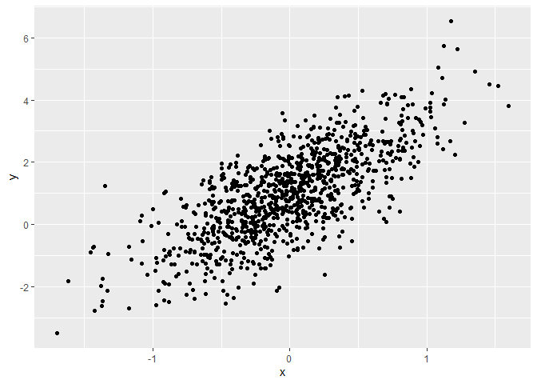
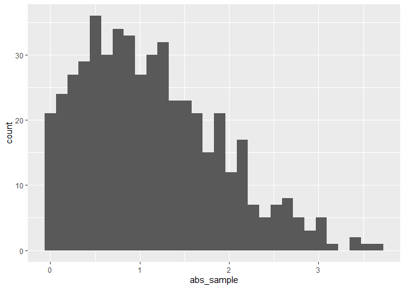

Simple document
================
Yijia Chen
2021-09-23

``` r
library(tidyverse)
```

I’m an R Markdown document!

# Section 1

Here’s a **code chunk** that samples from a *normal distribution*:

``` r
samp = rnorm(100)
length(samp)
```

    ## [1] 100

# Section 2

I can take the mean of the sample, too! The mean is -0.0989869.

# Section 3

Let’s write a new code chunk.

This code chunk imports the ‘tidyverse’, creates a data frame, and makes
a histogram

``` r
set.seed(1234)

plot_df = tibble(
  x = rnorm(1000, sd = .5),
  y = 1 + 2 * x + rnorm(1000),
)

ggplot(plot_df,aes(x=x, y=y)) + geom_point()
```

<!-- -->

# Learning assessment

Write a named code chunk that creates a dataframe comprised of: a
numeric variable containing a random sample of size 500 from a normal
variable with mean 1; a logical vector indicating whether each sampled
value is greater than zero; and a numeric vector containing the absolute
value of each element. Then, produce a histogram of the absolute value
variable just created. Add an inline summary giving the median value
rounded to two decimal places.

``` r
set.seed(12)


la_df = tibble(
  sample = rnorm(500, mean = 1),
  gr_than_0 = sample > 0,
  abs_sample = abs(sample)
)

ggplot(la_df, aes(x=abs_sample)) + geom_histogram()
```

    ## `stat_bin()` using `bins = 30`. Pick better value with `binwidth`.

<!-- -->

``` r
median_sample = median(pull(la_df, sample))
```

The median of the variable containing absolute values is 0.97

*here is a list *more list
